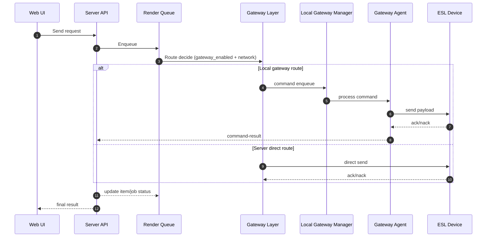

# Local Gateway Manager Derin Analiz ve Degisim Plani

- Dokuman tarihi: `2026-02-12 12:35:53 +03:00`
- Ortam: `c:\xampp\htdocs\market-etiket-sistemi`
- Kapsam: `local-gateway-manager` (dev/exe), gateway ayarlari, queue iliskisi, local ve server gonderim senaryolari, setup modu
- Durum: Bu dokuman kod tabani uzerinden yapilan derin analizdir. Bu asamada kod degisikligi uygulanmamistir.

## 1) Yonetici Ozeti

Analiz sonucu sistemin temel akisi calisabilir durumda olsa da, guvenlik (auth/secret), komut yasam dongusu, config kaliciligi ve bazi entegrasyon noktalarinda kritik/orta seviye bosluklar oldugu goruldu. En kritik konu, gateway kayit ve kimlik dogrulama modelinin sertlestirilmesi ve komut sonuc takibinin cihaz seviyesinde tutarli hale getirilmesidir.

Ayrica istek dogrultusunda su davranis korunacak sekilde planlanmistir:

- Setup modunda IT uzmani sifresi ile giren kullanici,
- Sunucu gateway kodunu (veya config JSON'unu) alabilmeli/girebilmeli,
- Ve kaydedebilmelidir.

## 2) Incelenen Bilesenler

### 2.1 Local Gateway Manager (Electron)

- `local-gateway-manager/src/main/main.js`
- `local-gateway-manager/src/main/processManager.js`
- `local-gateway-manager/src/main/gatewayConfigService.js`
- `local-gateway-manager/src/main/configStore.js`
- `local-gateway-manager/src/renderer/renderer.js`
- `local-gateway-manager/resources/gateway/gateway.php`
- `local-gateway-manager/package.json`
- `local-gateway-manager/resources/installer.nsh`

### 2.2 Server Gateway API ve Middleware

- `api/index.php`
- `api/gateway/register.php`
- `api/gateway/heartbeat.php`
- `api/gateway/command-result.php`
- `middleware/GatewayAuthMiddleware.php`
- `public/assets/js/pages/settings/GatewaySettings.js`

### 2.3 Queue / Gonderim Akislari

- `api/render-queue/process.php`
- `api/templates/render.php`
- `api/devices/control.php`
- `api/devices/scan.php`
- `workers/RenderQueueWorker.php`
- `services/PavoDisplayGateway.php`

### 2.4 Veritabani Semasi (Migration)

- `database/migrations/032_create_gateways.sql`
- `database/migrations/044_render_queue_system.sql`

## 3) Setup Modu Mevcut Durum (IT Uzmani Sifresi + Gateway Kodu)

### 3.1 Giris Koruma Akisi

- Panel acilisi sifre penceresi ile korunuyor: `local-gateway-manager/src/main/main.js:358`.
- Varsayilan IT sifresi kodda tanimli: `local-gateway-manager/src/main/main.js:66`.
- Dogrulama varsayilan sifre + opsiyonel hashli ozel sifre ile yapiliyor: `local-gateway-manager/src/main/main.js:78`, `local-gateway-manager/src/main/main.js:96`.

### 3.2 Setup Ayari ve Sunucudan Gateway Kodu Alma

- Setup/API URL alani var: `local-gateway-manager/src/renderer/renderer.js:1444`.
- URL kaydi app config uzerinden yapiliyor: `local-gateway-manager/src/main/main.js:767`.
- Sunucudan kod/config cekme fetch akisi var: `local-gateway-manager/src/renderer/renderer.js:596`.
- Alinan veri mevcut PHP config ile merge edilip kaydediliyor: `local-gateway-manager/src/renderer/renderer.js:671`.

### 3.3 Bu Akis Icin Zorunlu Koruma Kriteri (Kabul Kriteri)

Asagidaki davranis fix surecinde bozulmayacak:

1. IT uzmani sifresi ile setup ekranina giris devam edecek.
2. Kullanici `gatewayCodeApiUrl` tanimlayip kaydedebilecek.
3. Sunucudan gelen gateway kodu/config cekilip editora dolacak.
4. Kullanici bu config'i kaydedebilecek (persist + gerekli restart davranisi).
5. Ag yoksa veya endpoint yoksa, manuel JSON duzenle-kaydet fallback'i calisacak.

Not: Repo icinde `gateway code` adli net bir API endpoint bulunamadi; mevcut model dis bir URL'e bagli calisiyor.

## 4) Dev Modu / EXE Modu Yapilandirma Durumu

### 4.1 PHP Gateway Config

- Dev mod: `resources/gateway/gateway.config.json`
- EXE mod: yazilabilir `%LOCALAPPDATA%\GatewayManager\gateway.config.json`
- Bu davranis `getPhpGatewayConfigPaths` ile uygulanmis: `local-gateway-manager/src/main/gatewayConfigService.js:85`, `local-gateway-manager/src/main/gatewayConfigService.js:94`.

### 4.2 Java Config

- Java config yolu dogrudan resources altina bakiyor: `local-gateway-manager/src/main/gatewayConfigService.js:166`.
- EXE/per-machine kurulumda yazma izni riski var (`nsis perMachine`): `local-gateway-manager/package.json:60`, `local-gateway-manager/package.json:61`.

### 4.3 App Config Kaliciligi

- `appConfig:update` tarafinda path alanlari izinli listede: `local-gateway-manager/src/main/main.js:767`.
- Ancak `configStore` bu path alanlarini bilerek kaydetmiyor: `local-gateway-manager/src/main/configStore.js:209`, `local-gateway-manager/src/main/configStore.js:231`.
- Sonuc: kullaniciya "kaydedildi" gorunse de bazi alanlar kalici olmayabilir (beklenti uyumsuzlugu).

## 5) Veritabani Tablolari ve Iliski Ozeti

### 5.1 Gateway Tablolari

Kaynak: `database/migrations/032_create_gateways.sql`

- `gateways`: gateway kimligi, `api_key`, `api_secret`, durum, heartbeat
- `gateway_devices`: gateway-cihaz eslesmesi
- `gateway_commands`: sunucudan gateway'e komut kuyrugu

### 5.2 Queue Tablolari

Kaynak: `database/migrations/044_render_queue_system.sql`

- `render_queue`: is/job seviyesi
- `render_queue_items`: cihaz seviyesi item
- Bu iki katman, gateway tarafinda `gateway_commands` ile kesiser.

## 6) Is Akisi (Mevcut Mimari)

### 6.1 Sequence (Local vs Server)

## 7) Bulgular (Oncelik Sirali)

### 7.1 Kritik Bulgular

1. `api_key` ile register akisinda `api_secret` geri donuyor.
- `api/gateway/register.php:24`
- `api/gateway/register.php:42`
- `api/gateway/register.php:43`

2. Gateway auth'ta signature zorunlu degil, key-only kabul var.
- `middleware/GatewayAuthMiddleware.php:47`

3. Komutlar heartbeat'te `pending -> sent` cekiliyor, stale `sent` icin otomatik geri alma/requeue mekanizmasi gorunmuyor.
- `api/gateway/heartbeat.php` (pending cekme ve sent update blogu)

### 7.2 Yuksek Bulgular

4. Bazi akislarda `gateway_commands` insert ederken `device_id` yazilmiyor; command-result cihaz durumunu bu alana gore guncelliyor.
- `api/render-queue/process.php:1395`
- `api/templates/render.php:1508`
- `api/devices/control.php:327`
- `api/gateway/command-result.php:52`

5. Queue timeout davranisi tutarsiz:
- `api/render-queue/process.php` timeout'ta `success=true` donebiliyor: `api/render-queue/process.php:1479`
- `api/templates/render.php` benzer durumda fail donuyor (davranis farki): `api/templates/render.php` (gateway timeout blogu)

6. PHP config kaydindan sonra restart kontrolunde status case uyumsuzlugu var.
- Process state uppercase: `local-gateway-manager/src/main/processManager.js:313`
- Kontrol lowercase: `local-gateway-manager/src/main/main.js:726`, `local-gateway-manager/src/renderer/renderer.js:678`

7. Sifre modeli ve dokumantasyon tutarsiz.
- Kod varsayilan sifre: `local-gateway-manager/src/main/main.js:66`
- README'de farkli sifre (`admin123`): `local-gateway-manager/README.md:149`

8. Electron security hardening eksik (prod icin riskli).
- `nodeIntegration: true`: `local-gateway-manager/src/main/main.js:155`, `local-gateway-manager/src/main/main.js:538`
- `contextIsolation: false`: `local-gateway-manager/src/main/main.js:156`, `local-gateway-manager/src/main/main.js:539`

### 7.3 Orta Bulgular

9. Java config yazim yolu EXE modunda yazma yetkisi riski tasiyor.
- `local-gateway-manager/src/main/gatewayConfigService.js:166`
- `local-gateway-manager/package.json:60`

10. `gateway_enabled` kontrolu tum API'lerde homojen degil.
- Var: `api/render-queue/process.php:58`, `api/templates/render.php:221`, `api/devices/control.php:86`
- Eksik/tutarsiz yonlendirme: `api/devices/scan.php:46`

11. `devices/control` icinde `uploadFile` arguman sirasi supheli.
- Cagri: `api/devices/control.php:642`
- Imza: `services/PavoDisplayGateway.php:50`

12. Worker akisi ile HTTP process akisi farkli yol izliyor (davranis farki uretebilir).
- `workers/RenderQueueWorker.php:434`
- `api/render-queue/process.php` (gateway karar/blogu)

13. Installer genel `php.exe` / `java.exe` processlerini sert olduruyor.
- `local-gateway-manager/resources/installer.nsh:7`
- `local-gateway-manager/resources/installer.nsh:9`

14. Panel tarafi API secret'i acik gosteriyor/copy ediyor (operasyonel risk).
- `public/assets/js/pages/settings/GatewaySettings.js:433`
- `public/assets/js/pages/settings/GatewaySettings.js:448`

## 8) Degisiklik Stratejisi (Asamali)

### P0 - Guvenlik ve Dogruluk

1. Register ve gateway auth modelini sertlestir.
2. `api_secret` geri donusunu kaldir (sadece ilk provisioning tokenized model veya tek sefer, stricter).
3. Signature+timestamp'i zorunlu yap (en azindan write endpoint'lerde).
4. `gateway_commands` insert contract: `device_id` zorunlu/validasyonlu.
5. Setup modu akisini bozmadan kimlik ve secret dagitimini guvenli hale getir.

### P1 - Is Akisi Tutarliligi

1. `sent` komutlar icin stale timeout + requeue/retry policy ekle.
2. Timeout semantigini standartlastir (`accepted/queued` vs `delivered` ayrik donecek).
3. `gateway_enabled` kontrolunu scan dahil tum giris noktalarinda ayni policy ile uygula.
4. Worker ve API process akisini tek policy motoruna yaklastir.

### P2 - Operasyon ve UX

1. Process status enum normalization (tek format: `RUNNING/STOPPED/...`).
2. App config kaydetme davranisini UI beklentisiyle uyumlu hale getir.
3. Java config icin writable mirror (appdata) modeli uygula.
4. Electron hardening (preload allowlist + isolation).
5. README/versiyon/sifre bilgilerini kodla senkronla.

## 9) Setup Modu Icin Net Koruma Plani

Bu proje istegi icin ek zorunlu plan:

1. "IT uzmani sifresi ile setup girisi" aynen korunacak.
2. "Sunucu gateway kodu gir/al ve kaydet" akisi korunacak.
3. Guvenlik sertlestirmesi yapilirken bu akis kirilmayacak; gerekiyorsa tokenized/role-based fetch modeli eklenecek.
4. UI'de basarili kayit mesaji sadece gercekten persist olan alanlarda gosterilecek.
5. Kayit sonrasi restart durum mesaji process state normalize edilerek dogru gosterilecek.

## 10) Test Matrisi (Fix Sonrasi Kosulacak)

### 10.1 Setup / IT Sifre

1. Varsayilan sifre ile giris.
2. Ozel sifre ile giris.
3. Sifre degistirme sonrasi yeniden dogrulama.
4. 3 hatali denemede kilitleme/iptal davranisi.

### 10.2 Gateway Code ve Config Kaydetme

1. `gatewayCodeApiUrl` kaydet -> yeniden ac -> kalicilik kontrol.
2. Fetch gateway code -> editor dolumu -> kaydet -> dosya persist kontrol.
3. Endpoint yokken hata mesaji + manuel JSON kaydetme fallback.

### 10.3 Dev/EXE Mod

1. Dev modda config path dogrulama.
2. EXE modda `%LOCALAPPDATA%` yazma/okuma dogrulama.
3. Java config yaziminda yetki testi.

### 10.4 Gonderim Senaryolari

1. Local gateway route (queue -> command -> result).
2. Server direct route.
3. Gateway offline/stale heartbeat fallback.
4. Timeout/retry/requeue.
5. `gateway_enabled` on/off tum endpointlerde beklenen davranis.

## 11) Uygulama Durumu

- Bu dokuman bu turde olusturuldu.
- Kod degisikligi bu turde uygulanmadi.
- Sonraki adimda bu dokuman altindaki P0 backlog'una gore patch uygulanabilir.

## 12) Uygulanan Degisiklikler (2026-02-12)

Bu bolumde asagidaki P0/P1 fixleri uygulanmistir.

### 12.1 Guvenlik Sertlestirmeleri

1. `api/gateway/register.php`
- API key ile mevcut gateway guncelleme akisi imzali istek (timestamp + HMAC signature) zorunlu hale getirildi.
- Mevcut gateway update response'undan `api_secret` kaldirildi.
- Ilk kayit akisi (Bearer token ile yeni gateway olusturma) korunarak setup/provisioning davranisi bozulmadi.

2. `middleware/GatewayAuthMiddleware.php`
- Gateway auth icin `X-Gateway-Signature` ve `X-Gateway-Timestamp` zorunlu hale getirildi.
- Timestamp format/delta kontrolu ve HMAC dogrulamasi zorunlu yapildi.

### 12.2 Komut Yasam Dongusu Iyilestirmeleri

3. `api/gateway/heartbeat.php`
- `sent/executing` durumunda stale kalan komutlar icin otomatik requeue eklendi (180 saniye timeout).
- Bu sayede agent kopmasi/yarida kalma durumunda komutlar tekrar `pending`e alinabiliyor.

4. `api/render-queue/process.php`
- Gateway komut insertine `device_id` eklendi.
- Gateway timeout durumunda `success=true` donme kaldirildi.
- Timeout'ta komut `gateway_commands.status=timeout` olarak isaretlenip item tarafinda retrylenebilir hata uretiliyor.

5. `api/templates/render.php`
- Gateway komut insertine `device_id` eklendi.
- Timeout durumunda `gateway_commands.status=timeout` update eklendi.

6. `api/devices/control.php`
- Gateway komut insertine `device_id` eklendi.

### 12.3 Dogruluk/Bug Fix

7. `api/devices/control.php`
- `PavoDisplayGateway::uploadFile($ip, $filePath, $content, ...)` imzasina uygun olacak sekilde parametre sirasi duzeltildi.

8. `local-gateway-manager/src/main/main.js`
9. `local-gateway-manager/src/renderer/renderer.js`
- Process state karsilastirmalari `RUNNING` enumu ile uyumlu hale getirildi (restart/save mesaji bug fix).

10. `local-gateway-manager/resources/gateway/gateway.php`
- Register response'unda `api_secret` gelmezse mevcut config'deki secret'i koruyan fallback eklendi.

### 12.4 Setup Modu Kriteri

Asagidaki kritik is gereksinimi korunmustur:
- IT uzmani sifresiyle setup girisi,
- sunucu gateway code/config alma/girme,
- config kaydetme akisinin calismasi.

Bu turde setup ekraninin bu davranisini bozacak bir degisiklik uygulanmamistir.

### 12.5 Teknik Dogrulama

Degisen dosyalarda syntax kontrolleri basarili:
- `php -l api/gateway/register.php`
- `php -l middleware/GatewayAuthMiddleware.php`
- `php -l api/gateway/heartbeat.php`
- `php -l api/render-queue/process.php`
- `php -l api/templates/render.php`
- `php -l api/devices/control.php`
- `php -l local-gateway-manager/resources/gateway/gateway.php`
- `node --check local-gateway-manager/src/main/main.js`
- `node --check local-gateway-manager/src/renderer/renderer.js`

### 12.6 P1 Devam Fixleri (Bu Tur)

11. `api/devices/scan.php`
- `gateway_enabled` ayari okundu (company + user override).
- Gateway kapaliyken (`gateway_enabled=false`) gateway mode/gateway_id ile tarama bloke edildi.
- Private subnet icin otomatik gateway'e yonlendirme sadece `gateway_enabled=true` iken calisacak sekilde guncellendi.
- Fast ve final response payload'ina `gateway_enabled` eklendi.

12. `services/RenderQueueService.php`
- `getPendingItems()` sorgusuna gateway baglam alanlari eklendi:
  - `gateway_id`
  - `gateway_local_ip`
  - `gateway_status`
  - `gateway_last_heartbeat`

13. `workers/RenderQueueWorker.php`
- Worker gonderim akisi hybrid hale getirildi:
  - Gateway-eligible cihazlar `send_label` command akisi ile gateway uzerinden islenir.
  - Diger cihazlar mevcut paralel direct send akisi ile islenir.
- Worker icine firma bazli `gateway_enabled` okuma yardimcisi eklendi.
- Gateway send timeout/fail durumlarinda item fail + retry sayaci artisi korunur.

### 12.7 Bu Tur Teknik Dogrulama

Ek olarak basarili gecen kontroller:
- `php -l api/devices/scan.php`
- `php -l services/RenderQueueService.php`
- `php -l workers/RenderQueueWorker.php`

### 12.8 P1 Devam Fixleri (Bu Tur - Ek)

14. `services/RenderQueueService.php`
- Retry backoff hesaplamasi firma ayari ile overridable hale getirildi.
- `scheduleRetry()` icinde `company_id` baglami `calculateBackoff()` fonksiyonuna aktarildi.
- Desteklenen ayar key'leri (settings.data):
  - `render_retry_base_delay_seconds` (fallback: `retry_base_delay_seconds`)
  - `render_retry_max_delay_seconds` (fallback: `retry_max_delay_seconds`)
  - `render_retry_backoff_multiplier` (fallback: `retry_backoff_multiplier`)
- Koruma kurallari eklendi:
  - `base_delay_seconds >= 1`
  - `max_delay_seconds >= base_delay_seconds`
  - `backoff_multiplier >= 1.0`

15. `workers/RenderQueueWorker.php`
- Sinif property alaninda olusan bozuk satir (`\`r\`n` kacagi) duzeltildi.
- Worker dosyasinin parse hatasi giderildi.

### 12.9 Bu Tur Teknik Dogrulama (Ek)

- `php -l services/RenderQueueService.php`
- `php -l workers/RenderQueueWorker.php`
- `php workers/RenderQueueWorker.php --status`

### 12.10 P2 Uygulama (Bu Tur - UI + Scope)

16. `api/settings/index.php`
- `scope=company` destegi eklendi:
  - `GET /api/settings?scope=company` -> sadece firma (`company_id + user_id IS NULL`) ayari doner.
  - `PUT /api/settings?scope=company` -> firma ayarini gunceller/olusturur.
- Firma scope icin `Admin/SuperAdmin` yetki kontrolu eklendi.
- PUT icinde `scope` query/body degeri settings JSON'ina yazilmayacak sekilde filtrelendi.
- Varsayilan (scope verilmezse) kullanici ayari davranisi korunmustur.

17. `public/assets/js/pages/settings/GatewaySettings.js`
- Gateway ayarlari sayfasina yeni "Gateway Runtime Ayarlari" karti eklendi.
- Eklenen ayarlar:
  - `render_retry_base_delay_seconds`
  - `render_retry_max_delay_seconds`
  - `render_retry_backoff_multiplier`
  - `gateway_heartbeat_timeout_seconds`
  - `gateway_command_timeout_seconds`
  - `gateway_poll_interval_ms`
- UI kaydetme akisi `company` scope ile kaydetmeyi dener; yetki yoksa kontrollu sekilde user scope'a fallback eder.
- Gateway on/off toggle kaydi da ayni scope-aware akisla guncellendi.
- Runtime degerlerinde normalize/guard kurallari eklendi (min degerler ve max>=base).

18. `public/assets/css/pages/gateway.css`
- Runtime ayar karti icin yeni stiller eklendi.
- Mobil gorunumde runtime ayar grid'i ve kaydetme aksiyonu responsive hale getirildi.

### 12.11 Bu Tur Teknik Dogrulama (Ek)

- `php -l api/settings/index.php`
- `node --check public/assets/js/pages/settings/GatewaySettings.js`

### 12.12 P2 Tamamlama (Bu Tur - Java Mirror + Electron Hardening + Senkron)

19. `local-gateway-manager/src/main/gatewayConfigService.js`
- Java/ESL Working config icin EXE modda writable mirror modeli tamamlandi:
  - `%LOCALAPPDATA%\\GatewayManager\\eslworking-2.5.3\\config\\`
  - `config.properties`, `uplink_api.properties`, `jdbc.properties`
- Ilk calistirmada resources altindaki config dosyalari AppData mirror'a kopyalanir.
- Java runtime home bilgisi de path API'sine eklendi:
  - `runtimeHome`
  - `resourceHome`
  - `configDir`

20. `local-gateway-manager/src/main/processManager.js`
- Java baslatma akisi `eslworking.bat` uzerinden degil, dogrudan `java.exe` + classpath ile calisacak sekilde guncellendi.
- `-Deslworking.home` writable runtime home (AppData mirror) olarak set edildi.
- Classpath, writable `configDir` + resources `lib/*` olacak sekilde duzenlendi.
- Bu sayede Program Files yazma yetkisi kaynakli log/config problemleri azaltildi.

21. `local-gateway-manager/src/main/main.js`
- Electron hardening uygulandi:
  - Tum pencerelerde `nodeIntegration: false`
  - Tum pencerelerde `contextIsolation: true`
  - Password prompt penceresine de `preload` baglandi.
- Password prompt ic scripti, dogrudan `require('electron')` yerine preload API (`window.passwordPromptAPI`) kullanacak sekilde guncellendi.

22. `local-gateway-manager/src/main/preload.js`
- Preload dosyasi `contextBridge` allowlist modeline tasindi.
- Expose edilen API'ler:
  - `gatewayAPI` (IPC operasyonlari)
  - `passwordPromptAPI` (setup/password prompt kanallari)
  - `appDeps` (renderer icin `React`, `ReactDOMClient`, `FluentUI`)

23. `local-gateway-manager/src/renderer/renderer.js`
- `require(...)` kullanimlari kaldirildi.
- Renderer bagimliliklari preload'den (`window.appDeps`) alinacak sekilde guncellendi.
- Hardcoded surum fallback'i `v-` yapildi; acilista gercek surum IPC ile yukleniyor.

24. `local-gateway-manager/src/renderer/index.html`
- Temel CSP meta etiketi eklendi.

25. `local-gateway-manager/README.md`
- Varsayilan sifre bilgisi `omnex2024` ile kodla senkronlandi.
- Gateway config path bilgisi dev/prod ayrimi ile guncellendi.
- Java config/runtime path bilgileri (AppData mirror) eklendi.

### 12.13 Bu Tur Teknik Dogrulama (Ek)

- `node --check local-gateway-manager/src/main/main.js`
- `node --check local-gateway-manager/src/main/processManager.js`
- `node --check local-gateway-manager/src/main/gatewayConfigService.js`
- `node --check local-gateway-manager/src/main/preload.js`
- `node --check local-gateway-manager/src/renderer/renderer.js`

### 12.14 Dev Mod Beyaz Ekran Duzeltmesi (Bu Tur)

26. Koken Neden
- Dev ortaminda `ELECTRON_RUN_AS_NODE=1` set kaldiginda `app.whenReady()` cagrisi kiriliyor ve pencere acilis akisi bozuluyor.
- Ek olarak, `window.appDeps` uzerinden React/FluentUI bridge akisi bazi ortamlarda renderer bagimliliklarini bos dondurup beyaz ekrana neden olabiliyor.

27. Uygulanan Duzeltmeler
- `local-gateway-manager/src/main/preload.js`
  - `React/ReactDOMClient/FluentUI` preload bridge kaldirildi.
  - `contextIsolation` durumuna gore tek API expose helper eklendi:
    - izole mod: `contextBridge.exposeInMainWorld`
    - izole degilse: `window[key] = value`
- `local-gateway-manager/src/main/main.js`
  - Main panel penceresinde uyumluluk icin:
    - `nodeIntegration: true`
    - `contextIsolation: false`
  - Renderer tesisi icin hata tespiti loglari eklendi:
    - `did-finish-load`
    - `did-fail-load`
    - `render-process-gone`
    - `console-message`
- `local-gateway-manager/src/renderer/renderer.js`
  - Bagimlilik yukleme stratejisi fallback'li hale getirildi:
    - Once `window.appDeps` (geriye uyumluluk)
    - Yoksa `require('react')`, `require('react-dom/client')`, `require('@fluentui/react')`
  - Bagimlilik yuklenemezse bos beyaz ekran yerine root'a hata metni basilir.

28. Dogrulama
- `node --check local-gateway-manager/src/main/preload.js`
- `node --check local-gateway-manager/src/main/main.js`
- `node --check local-gateway-manager/src/renderer/renderer.js`
- `npm start` ile dev acilisi tekrarlandi (uzun sureli process oldugu icin terminal timeout beklenen davranistir).

### 12.15 Java Durum Senkronizasyon Duzeltmesi (Bu Tur)

29. Koken Neden
- Java gateway ana process tarafinda gecikmeli (2 sn) baslatiliyor.
- Renderer ilk acilista status'u bir kez okuyordu; sonradan otomatik status yenilemesi olmadigi icin kart bazi senaryolarda `STOPPED` gorunmeye devam ediyordu.

30. Uygulanan Duzeltmeler
- `local-gateway-manager/src/renderer/renderer.js`
  - `getStatus()` icin 2 saniyelik periyodik poll eklendi.
  - Ilk acilista anlik status cekme + interval ile surekli senkronizasyon saglandi.
  - `subscribeLogs` icin unsubscribe cleanup eklendi (memory leak/tekrarli listener onlemi).
- `local-gateway-manager/src/main/processManager.js`
  - `getStatus()` sonucu process handle gercegiyle normalize edildi:
    - process canliysa en az `RUNNING`/`STARTING` dondurulur.
    - boylece state-process gecici desync durumlarinda UI yanlis `STOPPED` gostermez.

31. Dogrulama
- `node --check local-gateway-manager/src/main/processManager.js`
- `node --check local-gateway-manager/src/renderer/renderer.js`

### 12.16 Java Port Health Check Entegrasyonu (Bu Tur)

32. Koken Neden
- Sadece process PID/handle bazli durum, Java process hayatta olsa bile servis portu henuz acilmamisken gercek hazirlik durumunu yansitmiyordu.

33. Uygulanan Duzeltmeler
- `local-gateway-manager/src/main/processManager.js`
  - Java icin aktif health monitor eklendi:
    - Host: `127.0.0.1`
    - Port: `9000`
    - Probe interval: `3000ms`
    - Probe timeout: `800ms`
    - Startup grace: `25000ms`
    - Failure threshold: `3`
  - `startJava()` sonrasi periyodik TCP probe baslatiliyor.
  - Port ulasilabilir oldugunda Java status `RUNNING` yapiliyor.
  - Port ulasilamazsa grace/threshold kurallarina gore `STARTING` veya `ERROR` durumuna geciliyor.
  - `stopJava` / `exit` / `error` akislari health monitor'u temizliyor.
  - `getStatus()` cikisina yeni alanlar eklendi:
    - `javaHealthOk`
    - `javaHealthPort`
    - `javaHealthLastCheckedAt`
    - `javaHealthError`
    - `javaHealthFailCount`
- `local-gateway-manager/src/renderer/renderer.js`
  - Alt durum cubuguna Java port health gostergesi eklendi:
    - `Port 9000: OK / Kontrol / Erisilemiyor`

34. Dogrulama
- `node --check local-gateway-manager/src/main/processManager.js`
- `node --check local-gateway-manager/src/renderer/renderer.js`

### 12.17 EXE Mod Java Baslangic Hatasi (communication key) Duzeltmesi

35. Koken Neden
- EXE modda runtime `config` dizinine sadece 3 dosya mirror ediliyordu:
  - `config.properties`
  - `uplink_api.properties`
  - `jdbc.properties`
- `server.conf` ve `log4j2.xml` mirror edilmedigi icin Java tarafi Typesafe config icinde `communication` blogunu bulamiyor ve su hata ile cikiyordu:
  - `ConfigException$Missing: No configuration setting found for key 'communication'`
- Ayrica loglarda `No log4j2 configuration file found` goruluyordu.

36. Uygulanan Duzeltmeler
- `local-gateway-manager/src/main/gatewayConfigService.js`
  - Java runtime config mirror kapsami genisletildi.
  - EXE modda AppData runtime config dizinine eksikse otomatik kopyalanan ek girdiler:
    - `server.conf`
    - `log4j2.xml`
    - `detection.conf`
    - `additional_esl_config.json`
    - `truststore.jks`
    - `eslworking.jks`
    - `firmware/`, `heatp/`, `segmentcode/` dizinleri
  - Dizin kopyalama icin recursive helper eklendi.
  - `getJavaConfigPaths()` cikisina `resourceConfigDir` eklendi.
- `local-gateway-manager/src/main/processManager.js`
  - Java classpath guncellendi:
    - `AppData configDir`
    - `resource configDir` (fallback)
    - `lib/*`
  - `-Dlog4j.configurationFile=...` parametresi eklendi (varsa runtime, yoksa resource log4j2.xml).
  - Debug loglara `Resource Config Dir` ve secilen `Log4j Config` eklendi.

37. Ek Stabilite Duzeltmesi
- Auto-restart deneme sayaci her restartta sifirlaniyordu ve loglarda hep `deneme 1/5` gorunuyordu.
- `startPhp/startJava` fonksiyonlarina `isAutoRestart` parametresi eklendi.
- Otomatik restart cagrilari sayaç sifirlamayacak sekilde guncellendi.

38. Dogrulama
- `node --check local-gateway-manager/src/main/gatewayConfigService.js`
- `node --check local-gateway-manager/src/main/processManager.js`
- Simule EXE senaryosunda AppData config mirror kontrolu:
  - `server.conf`, `log4j2.xml` ve diger gerekli dosyalarin olustugu dogrulandi.
