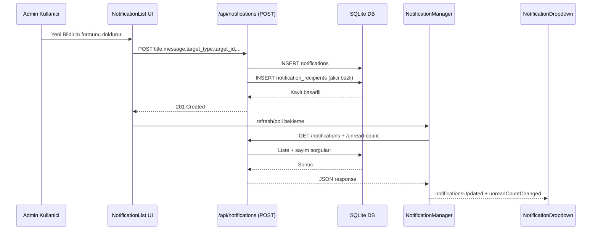
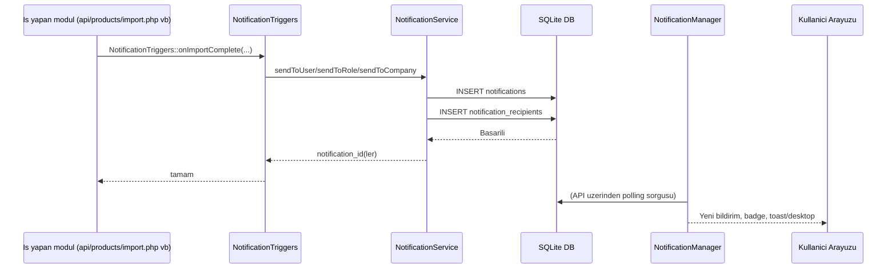
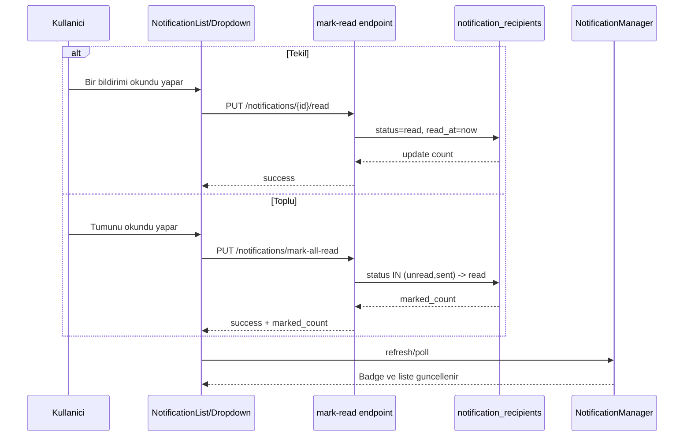
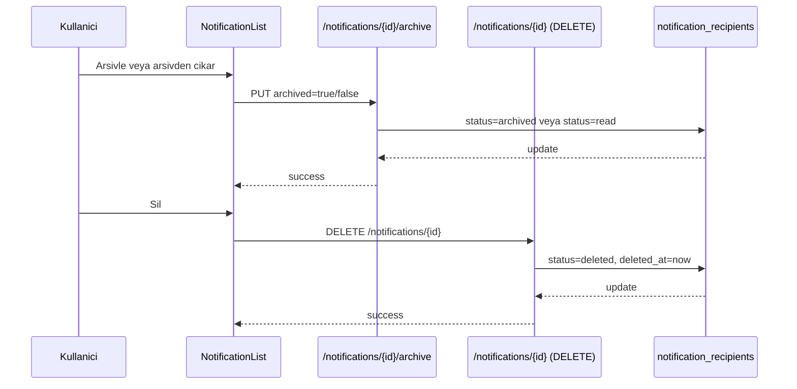
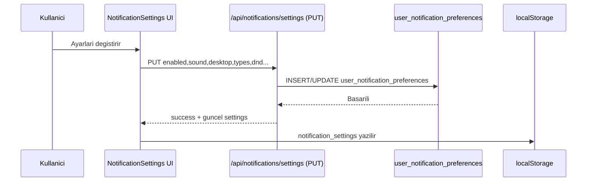

# Bildirim Sistemi Son Hali (Tarih/Saat)

- Dokuman tarihi: `2026-02-12 11:22:45 +03:00`
- Ortam: `c:\xampp\htdocs\market-etiket-sistemi`
- Kapsam: Mevcut kod tabani + canli SQLite semasi uzerinden bildirim sisteminin fiili durumu

## 1. Genel Mimari

Bildirim sistemi 4 ana katmandan olusuyor:

1. Frontend sayfalari ve header bileşenleri
2. API endpoint'leri (`/api/notifications/*`)
3. Servis katmani (`services/NotificationService.php`, `services/NotificationTriggers.php`)
4. Veritabani tablolari (`notifications`, `notification_recipients`, `user_notification_preferences`, legacy `notification_settings`)

## 2. Frontend Bilesenleri ve Sayfalar

### 2.1 Route baglantilari

- `public/assets/js/app.js:250` -> `#/notifications` -> `notifications/NotificationList`
- `public/assets/js/app.js:251` -> `#/notifications/settings` -> `notifications/NotificationSettings`

### 2.2 Layout ve header entegrasyonu

- `public/assets/js/layouts/LayoutManager.js:27` `NotificationManager` import eder.
- `public/assets/js/layouts/LayoutManager.js:28` `NotificationDropdown` import eder.
- `public/assets/js/layouts/LayoutManager.js:86-88` auth olduktan sonra manager+dropdown init edilir.
- Header'da zil dropdown render edilir (`render()` cagrisi).

### 2.3 NotificationList sayfasi

Dosya: `public/assets/js/pages/notifications/NotificationList.js`

Temel yetenekler:

- Listeleme, filtreleme (`active/unread/read/archived`)
- Toplu okundu, toplu arsiv, toplu silme
- Tekil okundu/arsiv/silme
- Admin/SuperAdmin icin manuel bildirim olusturma modal'i

Kullanilan API cagri kaliplari:

- `GET /notifications`
- `PUT /notifications/mark-all-read`
- `PUT /notifications/{id}/read`
- `PUT /notifications/{id}/archive` (body `archived: true/false`)
- `DELETE /notifications/{id}`
- `POST /notifications` (manuel bildirim)

### 2.4 NotificationSettings sayfasi

Dosya: `public/assets/js/pages/notifications/NotificationSettings.js`

Ayarlar:

- master enable/disable
- sound
- desktop
- type bazli kanal ayarlari (`web/push/email`)
- email digest (`never/daily/weekly`)
- dnd (`dnd_enabled`, `dnd_start`, `dnd_end`)

API:

- `GET /notifications/settings`
- `PUT /notifications/settings`

Ek davranis:

- Ayarlar `localStorage.notification_settings` altina da yaziliyor.
- Desktop izin isteme browser `Notification.requestPermission()` ile yapiliyor.

### 2.5 NotificationManager

Dosya: `public/assets/js/core/NotificationManager.js`

Sorumluluklar:

- 30 sn polling (`loadNotifications` + `loadUnreadCount`)
- Yeni bildirimde toast + desktop bildirimi
- Local state (`notifications`, `unreadCount`)
- Okundu/arsiv/silme islerinde local state senkronizasyonu

API kullanimi:

- `GET /notifications?limit=10&status=active`
- `GET /notifications/unread-count`
- `PUT /notifications/{id}/read`
- `PUT /notifications/mark-all-read`
- `PUT /notifications/{id}/archive`
- `DELETE /notifications/{id}`

Desktop bildirim notu:

- Browser Notification API kullaniliyor.
- DND kontrolu localStorage ayarlariyla yapiliyor.

### 2.6 NotificationDropdown

Dosya: `public/assets/js/components/NotificationDropdown.js`

- Header'da son bildirimleri (max 5) gosterir.
- Mark all read, tekil bildirim acma, modal detay gosteren yapiya sahip.

Onemli mevcut durum:

- Dropdown su an `window.addEventListener('notificationsUpdated', ...)` dinliyor.
- Manager ise DOM event'i `notification:notificationsUpdated` formatinda dispatch ediyor.
- Bu nedenle dropdown otomatik yenileme olayinda event adi uyumsuzlugu riski var.

## 3. API Katmani (Mevcut)

Router kaydi: `api/index.php:854-895`

Tanimli endpoint'ler:

1. `GET /api/notifications` -> `api/notifications/index.php`
2. `GET /api/notifications/unread-count` -> `api/notifications/unread-count.php`
3. `GET /api/notifications/settings` -> `api/notifications/settings.php`
4. `PUT /api/notifications/settings` -> `api/notifications/settings.php`
5. `PUT /api/notifications/mark-all-read` -> `api/notifications/mark-read.php`
6. `POST /api/notifications` -> `api/notifications/create.php`
7. `GET /api/notifications/{id}` -> `api/notifications/read.php`
8. `PUT /api/notifications/{id}/read` -> `api/notifications/mark-read.php`
9. `PUT /api/notifications/{id}/archive` -> `api/notifications/archive.php`
10. `DELETE /api/notifications/{id}` -> `api/notifications/delete.php`

API davranis notlari:

- Liste API'si `status=active` icin `('unread','sent','read')` dondurur.
- `mark-all-read` hem `unread` hem `sent` statulerini `read` yapar.
- `archive` endpoint'i unarchive da destekler (`archived:false`).
- `create` endpoint'i kanal whitelist uygular: `web/push/toast/email`.
- `create` endpoint'i tenant izolasyonuna dikkat eder (aktif firma baglami).

## 4. Servis Katmani ve Is Kurallari

### 4.1 NotificationService

Dosya: `services/NotificationService.php`

Ana metotlar:

- `sendToUser`, `sendToRole`, `sendToCompany`, `notifyAdmins`
- `getUnreadCount`, `markAsRead`, `markAllAsRead`, `archive`, `delete`
- `getUserNotifications`
- `getUserSettings`, `updateUserSettings`
- `cleanupExpired`

Onemli kurallar:

- Quiet hours kontrolu `user_notification_preferences` tablosundan okunuyor.
- DND metadata'si `type_preferences` icindeki `_dnd_enabled` ile de degerlendiriliyor.
- Role hedeflemede case-insensitive rol karsilastirma var (`LOWER(role)=LOWER(?)`).
- `sendToRole` de firma baglami yoksa ilk kullanici firmasina scope kilitleniyor.

### 4.2 NotificationTriggers

Dosya: `services/NotificationTriggers.php`

Tanimli tetikleyiciler (ornekler):

- `onUserRegistered`
- `onUserApproved`
- `onPasswordChanged`
- `onImportComplete`
- `onRenderJobsComplete`
- `onRenderJobsFailed`
- `onRoleChanged`
- `onUserDeactivated`
- `onStorageLimitWarning`
- `systemAnnouncement`

### 4.3 Tetikleyici cagrilan yerler (otomatik bildirim kaynaklari)

`NotificationTriggers::` cagrilari:

- `api/auth/register.php:144`
- `api/auth/change-password.php:49`
- `api/users/update.php:117`
- `api/users/update.php:121`
- `api/users/update.php:125`
- `api/products/import.php:366`
- `api/products/import.php:397`
- `api/products/import.php:801`
- `api/render-cache/process.php:177`
- `api/render-cache/process.php:187`
- `services/StorageService.php:299`
- `services/TamsoftGateway.php:810`
- `api/payments/callback.php:186`
- `api/payments/callback-3d.php:216`

Kritik not:

- Payment callback dosyalari `NotificationTriggers::onPaymentSuccess(...)` cagiriyor.
- `services/NotificationTriggers.php` icinde bu metot mevcut degil.
- Bu satirlar runtime'da method-not-found hatasi uretebilir (ozellikle callback akisinda).

## 5. Veritabani Tablolari (Canli DB)

Canli DB: `database/omnex.db`

Sayim:

- `notifications`: 27
- `notification_recipients`: 0
- `user_notification_preferences`: 1
- `notification_settings`: 0

### 5.1 `notifications`

Canli kolonlar:

- `id`
- `company_id`
- `title`
- `message`
- `type` (default `'info'`)
- `target_type` (default `'all'`)
- `target_id`
- `action_url` (legacy)
- `priority` (default `'normal'`)
- `created_by`
- `created_at` (default `datetime('now')`)
- `icon`
- `link`
- `channels` (default `'["web"]'`)
- `expires_at`

Not:

- Hem `action_url` hem `link` kolonlari var. Kod yeni yapida `link` kullaniyor.

### 5.2 `notification_recipients`

Canli kolonlar:

- `id`
- `notification_id`
- `user_id`
- `status` (default `'sent'`)
- `read_at`
- `archived_at`
- `deleted_at`

Not:

- Service/API `unread/read/archived/deleted` semantigiyle calisiyor.
- Tablo default'u `sent`, kod insert'leri cogu yerde `unread` yaziyor.
- API bu farki tolere etmek icin `sent` statuyu da aktif/unread kabul ediyor.

### 5.3 `user_notification_preferences`

Canli kolonlar:

- `id`
- `user_id`
- `email_enabled`
- `push_enabled`
- `toast_enabled`
- `web_enabled`
- `sound_enabled`
- `type_preferences` (JSON)
- `quiet_start`
- `quiet_end`
- `created_at`
- `updated_at`

Kullanim:

- Kullanici bildirim ayarlari ana tablo olarak burada tutuluyor.

### 5.4 `notification_settings` (legacy)

Canli kolonlar mevcut ama su an aktif akisin ana tablo su degil:

- `enabled`, `sound`, `desktop`, `types`, `email_digest`, `dnd_enabled`, `dnd_start`, `dnd_end` vb.

Durum:

- Migration dokumanlarinda eski/yeni ayrimi var.
- Kodun guncel ayar API'si `user_notification_preferences` kullaniyor.
- Bu tablo teknik borc/legacy iz olarak duruyor.

## 6. Islem Akislari

### 6.1 Manuel bildirim olusturma akisi

1. Admin/SuperAdmin `#/notifications` sayfasindan modal aciyor.
2. `POST /api/notifications` ile kayit olusturuluyor.
3. Hedef tipine gore alicilar seciliyor (`user/role/company/all`).
4. `notifications` + `notification_recipients` satirlari yaziliyor.
5. Polling ile NotificationManager yeni bildirimi cekip UI'a yansitiyor.

### 6.2 Otomatik tetikleyici akisi

1. Diger API/servislerde business event olusuyor (register/import/render vb).
2. Ilgili dosya `NotificationTriggers::...` cagiriyor.
3. Trigger, `NotificationService` uzerinden hedefli bildirim uretiyor.
4. Recipient satirlari olusturuluyor.
5. Frontend polling ile gorunur hale geliyor.

### 6.3 Okundu/arsiv/silme akisi

- Tekil okundu: `PUT /notifications/{id}/read`
- Toplu okundu: `PUT /notifications/mark-all-read`
- Arsiv/arsivden cikar: `PUT /notifications/{id}/archive` (`archived=true/false`)
- Soft delete: `DELETE /notifications/{id}`

### 6.4 Ayar kaydetme akisi

1. `#/notifications/settings` sayfasi formu doldurur.
2. `PUT /notifications/settings` ile backend'e map edilir.
3. Backend `user_notification_preferences` tablosunu update/insert eder.
4. Frontend ayni ayari localStorage'a da yazar.

## 7. Browser/Mobil/Push Durumu (Mevcut)

### 7.1 Browser desktop notification

- Destek var (Notification API).
- Izin ve DND kontrolu yapiliyor.
- Bildirimler polling sonucu geldiğinde localde gosteriliyor.

### 7.2 Service Worker push event

- `public/sw.js` icinde `self.addEventListener('push', ...)` mevcut.
- Ancak uygulama tarafinda push subscription yonetimi yok:
  - `PushManager.subscribe` akisi yok
  - VAPID/public key yonetimi yok
  - subscription saklayan API yok
  - server-side web-push gonderim implementasyonu yok

Sonuc:

- Gercek web push altyapisi tam bagli degil.
- Simdiki pratikte calisan kisim browser icinde polling + local Notification API.

### 7.3 Mobil push

- Projede FCM/OneSignal benzeri bir mobil push entegrasyonu gorunmuyor.
- Bu nedenle native mobil push seviyesi su an aktif degil.

## 8. Diger Sayfalarla Iliski

Bildirimle dolayli iliskilenen temel moduller:

- Kullanici yonetimi: onay/deaktif/rol degisimi eventleri
- Auth: kayit ve sifre degisimi eventleri
- Urun import/render: tamamlandi/basarisiz eventleri
- Storage/License/Payment: limit/odeme/lisans eventleri
- Cihaz/schedule: cihaz durum ve zamanlama hata eventleri

Bu iliski agirlikli olarak `NotificationTriggers` uzerinden kurulmus durumda.

## 9. Mevcut Teknik Risk/Ozet

1. `NotificationTriggers::onPaymentSuccess` referansi var, metot yok.
2. Dropdown event adi ile manager dispatch formati farkli.
3. `notifications` tablosunda legacy `action_url` kolonu hala mevcut.
4. `notification_recipients.status` default `sent`, kod semantigi `unread/read/...`.
5. Legacy `notification_settings` tablosu DB'de duruyor (aktif akista ana tablo degil).
6. Canli DB'de `notifications` kayit var ama `notification_recipients` 0; gecmis verilerde alim dagitim izi eksik olabilir.

## 10. Sequence Diyagramlari (Mermaid)

### 10.1 Manuel bildirim olusturma (Admin/SuperAdmin)

### 10.2 Otomatik tetikleyici akisi (or: import tamamlandi)

### 10.3 Okundu isaretleme (tekil + toplu)

### 10.4 Arsiv / Arsivden cikar / Sil

### 10.5 Ayar kaydetme (settings)

## 11. Referans Dosyalar

- `public/assets/js/app.js`
- `public/assets/js/layouts/LayoutManager.js`
- `public/assets/js/core/NotificationManager.js`
- `public/assets/js/components/NotificationDropdown.js`
- `public/assets/js/pages/notifications/NotificationList.js`
- `public/assets/js/pages/notifications/NotificationSettings.js`
- `api/index.php`
- `api/notifications/index.php`
- `api/notifications/create.php`
- `api/notifications/mark-read.php`
- `api/notifications/archive.php`
- `api/notifications/delete.php`
- `api/notifications/settings.php`
- `services/NotificationService.php`
- `services/NotificationTriggers.php`
- `database/migrations/018_create_notifications.sql`
- `database/migrations/019_create_notification_recipients.sql`
- `database/migrations/020_create_notification_settings.sql`
- `database/migrations/023_notifications_updates.sql`
- `database/migrations/009_create_system.sql`
- `public/sw.js`

